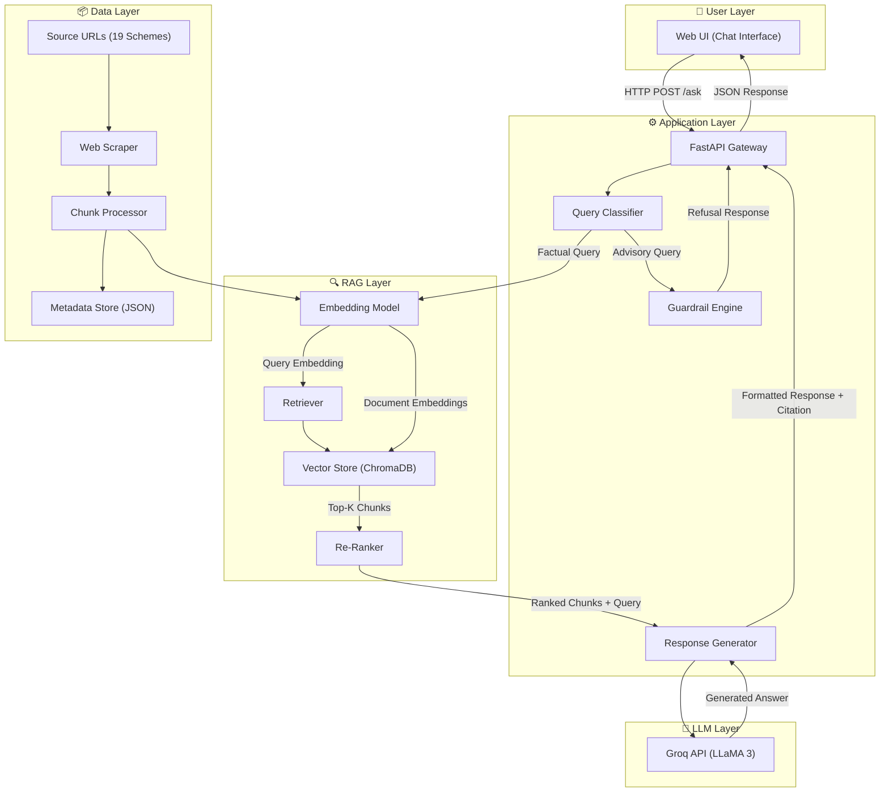
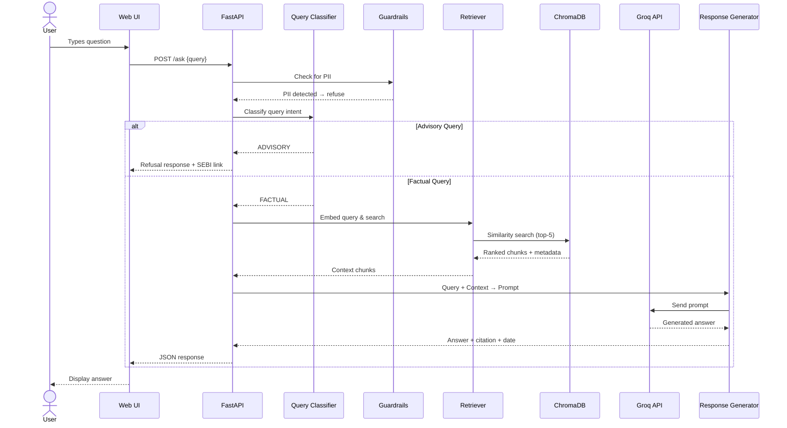
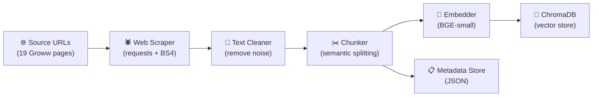
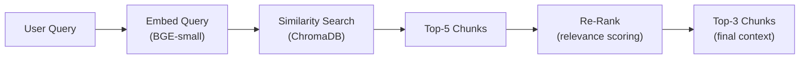
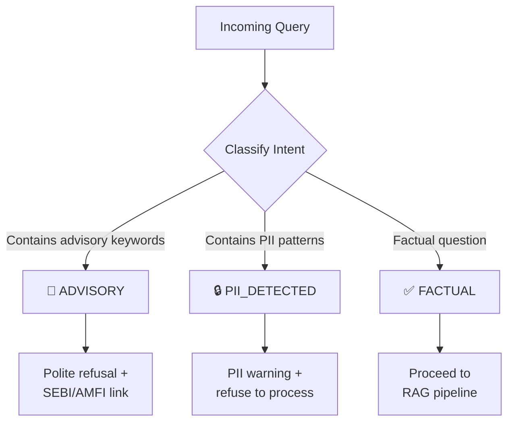
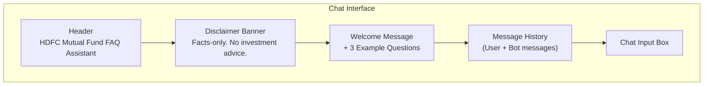
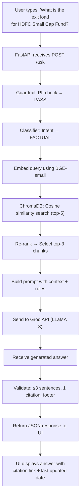
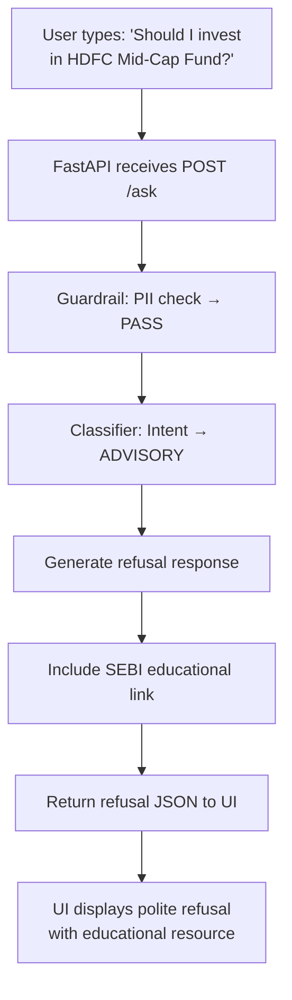

# Architecture Document — Mutual Fund FAQ Assistant

> **Project:** Facts-Only Mutual Fund FAQ Assistant  
> **AMC:** HDFC Asset Management Company  
> **Approach:** Retrieval-Augmented Generation (RAG)  
> **Last Updated:** June 2026

---

## Table of Contents

1. [High-Level Architecture](#1-high-level-architecture)
2. [System Components](#2-system-components)
3. [Data Ingestion Pipeline](#3-data-ingestion-pipeline)
4. [RAG Pipeline](#4-rag-pipeline)
5. [Query Classification & Guardrails](#5-query-classification--guardrails)
6. [Response Generation](#6-response-generation)
7. [User Interface](#7-user-interface)
8. [Technology Stack](#8-technology-stack)
9. [Data Flow](#9-data-flow)
10. [Directory Structure](#10-directory-structure)
11. [API Design](#11-api-design)
12. [Security & Privacy](#12-security--privacy)
13. [Error Handling](#13-error-handling)
14. [Known Limitations](#14-known-limitations)

---

## 1. High-Level Architecture



---

## 2. System Components

### 2.1 Component Overview

| Component | Responsibility | Technology |
|---|---|---|
| **Web Scraper** | Extracts text content from 19 Groww scheme pages | Python (`requests` + `BeautifulSoup`) |
| **Chunk Processor** | Splits scraped text into semantically meaningful chunks | `LangChain` Text Splitters |
| **Embedding Model** | Converts text chunks and queries into vector embeddings | `BAAI/bge-small-en-v1.5` (HuggingFace, local) |
| **Vector Store** | Stores and retrieves document embeddings via similarity search | `ChromaDB` (persistent) |
| **Query Classifier** | Determines if a query is factual or advisory | Rule-based + keyword matching |
| **Guardrail Engine** | Blocks advisory queries and PII; enforces compliance constraints | Custom Python module |
| **Retriever** | Fetches top-K relevant chunks from the vector store | ChromaDB similarity search |
| **Re-Ranker** | Re-ranks retrieved chunks by relevance to the query | Cross-encoder or heuristic scoring |
| **Response Generator** | Constructs the final answer using LLM with retrieved context | Groq API (`LLaMA 3 8B`) |
| **Web UI** | Modern chat interface for user interaction | Next.js (React) |
| **FastAPI Gateway** | REST API layer between the UI and the RAG backend | `FastAPI` |

### 2.2 Component Interaction Diagram



---

## 3. Data Ingestion Pipeline

The ingestion pipeline runs **offline** (one-time or on-demand) to build the knowledge base from the 19 HDFC scheme URLs.

### 3.1 Pipeline Stages



### 3.2 Scraping Strategy

| Step | Action | Details |
|---|---|---|
| 1 | Fetch page HTML | Send HTTP GET request to each Groww URL |
| 2 | Parse content | Extract key sections: scheme info, expense ratio, exit load, SIP details, risk, benchmark, etc. |
| 3 | Clean text | Remove ads, navigation, footers, scripts, and irrelevant HTML elements |
| 4 | Normalize | Standardize whitespace, format numbers, and remove special characters |

### 3.3 Chunking Strategy

| Parameter | Value | Rationale |
|---|---|---|
| **Strategy Type** | Hybrid Semantic Chunking | Leverages structured JSON fields directly rather than blind text splitting |
| **Fast Facts Chunk** | Full set of structured facts | Combines NAV, AUM, Expense Ratio, Manager, etc. into a single highly semantic chunk |
| **About Text Chunk** | Recursive Character (500 tokens / 50 overlap) | Safely splits long descriptive text while preserving context |
| **Context Preservation** | Scheme Name Prefixing | Every chunk is explicitly prefixed with the scheme name (e.g. `About HDFC Balanced...`) to prevent isolated context loss |
| **Metadata per chunk** | scheme name, source URL, section | Enables section-level filtering (e.g., `section: fund_details` vs `section: about_fund`) |

### 3.4 Metadata Schema

Each chunk is stored with the following metadata:

```json
{
  "chunk_id": "hdfc-mid-cap-001",
  "scheme_name": "HDFC Mid-Cap Fund – Direct Growth",
  "category": "Equity / Mid Cap",
  "source_url": "https://groww.in/mutual-funds/hdfc-mid-cap-fund-direct-growth",
  "section": "expense_ratio",
  "scrape_date": "2026-06-05",
  "content": "The expense ratio of HDFC Mid-Cap Fund Direct Plan is 0.75%..."
}
```

---

## 4. RAG Pipeline

### 4.1 Retrieval Flow



### 4.2 Retrieval Configuration

| Parameter | Value | Description |
|---|---|---|
| **Embedding model** | `BAAI/bge-small-en-v1.5` | Open-source HuggingFace embedding model (runs locally) |
| **Embedding dimension** | 384 | Vector size for similarity computation |
| **Distance metric** | Cosine similarity | Measures semantic closeness between vectors |
| **Top-K retrieval** | 5 | Initial candidates retrieved from vector store |
| **Top-N after re-rank** | 3 | Final chunks passed to the LLM as context |
| **Similarity threshold** | 0.7 | Minimum score to consider a chunk relevant |

### 4.3 Prompt Template

```text
You are a facts-only mutual fund FAQ assistant for HDFC mutual fund schemes.
Your role is to answer factual questions using ONLY the provided context.

RULES:
1. Answer in a maximum of 3 sentences.
2. Use ONLY the information from the context below.
3. Include exactly ONE source citation link.
4. Do NOT provide investment advice, opinions, or recommendations.
5. Do NOT compare fund performance or calculate returns.
6. If the context does not contain the answer, say "I don't have this information in my sources."
7. End every response with: "Last updated from sources: <date>"

CONTEXT:
{retrieved_chunks}

SOURCE URL: {source_url}
SCRAPE DATE: {scrape_date}

USER QUESTION: {user_query}

ANSWER:
```

---

## 5. Query Classification & Guardrails

### 5.1 Query Classification

The Query Classifier categorizes incoming queries into one of three intents:



### 5.2 Advisory Query Detection

Queries are flagged as **ADVISORY** if they match patterns such as:

| Pattern Category | Example Keywords / Phrases |
|---|---|
| **Recommendation** | "should I invest", "recommend", "suggest", "which fund is better" |
| **Comparison** | "compare", "better than", "which is best", "vs" |
| **Prediction** | "will it go up", "future returns", "expected growth" |
| **Opinion** | "what do you think", "is it good", "worth investing" |

### 5.3 Refusal Response Template

```text
I'm a facts-only assistant and cannot provide investment advice or recommendations.
For guidance on mutual fund investing, please visit SEBI's investor education page:
https://investor.sebi.gov.in/

Facts-only. No investment advice.
```

### 5.4 PII Detection

The Guardrail Engine scans queries for:

| PII Type | Detection Pattern |
|---|---|
| PAN Number | Regex: `[A-Z]{5}[0-9]{4}[A-Z]{1}` |
| Aadhaar Number | Regex: `[0-9]{4}\s?[0-9]{4}\s?[0-9]{4}` |
| Phone Number | Regex: `(\+91)?[6-9][0-9]{9}` |
| Email Address | Regex: `[a-zA-Z0-9._%+-]+@[a-zA-Z0-9.-]+\.[a-zA-Z]{2,}` |
| Account Number | Regex: `[0-9]{9,18}` |

---

## 6. Response Generation

### 6.1 Response Format

Every successful response follows this exact structure:

```json
{
  "status": "success",
  "query": "What is the expense ratio of HDFC Mid-Cap Fund?",
  "answer": "The expense ratio of HDFC Mid-Cap Fund Direct Plan is 0.75%. This is the Total Expense Ratio (TER) charged by the fund for managing investments.",
  "citation": {
    "url": "https://groww.in/mutual-funds/hdfc-mid-cap-fund-direct-growth",
    "scheme_name": "HDFC Mid-Cap Fund – Direct Growth"
  },
  "last_updated": "Last updated from sources: 2026-06-05",
  "disclaimer": "Facts-only. No investment advice."
}
```

### 6.2 Refusal Response Format

```json
{
  "status": "refused",
  "query": "Should I invest in HDFC Mid-Cap Fund?",
  "answer": "I'm a facts-only assistant and cannot provide investment advice or recommendations.",
  "educational_link": "https://investor.sebi.gov.in/",
  "disclaimer": "Facts-only. No investment advice."
}
```

### 6.3 Response Validation Checklist

| # | Rule | Validation |
|---|---|---|
| 1 | Max 3 sentences | Sentence count ≤ 3 |
| 2 | Exactly 1 citation | Citation URL present and valid |
| 3 | Footer present | `Last updated from sources: <date>` appended |
| 4 | No advice | No advisory language in output |
| 5 | Source-backed | Answer derived from retrieved context only |

---

## 7. User Interface

### 7.1 UI Components



### 7.2 UI Specifications

| Element | Description |
|---|---|
| **Header** | App title: "HDFC Mutual Fund FAQ Assistant" |
| **Disclaimer** | Persistent banner: _"Facts-only. No investment advice."_ |
| **Welcome message** | Greeting with brief explanation of capabilities |
| **Example questions** | 3 clickable example queries (e.g., "What is the expense ratio of HDFC Mid-Cap Fund?") |
| **Chat input** | Text input with send button |
| **Response display** | Bot message with answer, citation link, and last-updated footer |
| **Loading state** | Spinner or skeleton while waiting for the response |

### 7.3 Example Questions (Pre-configured)

1. _"What is the expense ratio of HDFC Mid-Cap Fund?"_
2. _"What is the exit load for HDFC Small Cap Fund?"_
3. _"What is the minimum SIP amount for HDFC Nifty 50 Index Fund?"_

---

## 8. Technology Stack

### 8.1 Stack Overview

| Layer | Technology | Purpose |
|---|---|---|
| **Frontend** | Next.js (React) | Modern chat UI with SSR/CSR support |
| **Backend API** | Python + FastAPI | REST API gateway |
| **LLM** | Groq API (`LLaMA 3 8B`) | Ultra-fast LLM response generation |
| **Embeddings** | `BAAI/bge-small-en-v1.5` (HuggingFace) | Local text → vector conversion (384-dim) |
| **Vector Store** | ChromaDB | Persistent vector storage & similarity search |
| **Orchestration** | LangChain | RAG pipeline orchestration |
| **Web Scraping** | `requests` + `BeautifulSoup4` | Data extraction from Groww |
| **Environment** | Python 3.11+ / Node.js 18+ | Backend + frontend runtimes |
| **Dependency Mgmt** | `pip` + `requirements.txt` / `npm` | Package management |
| **Config** | `.env` file | API keys, model params |

### 8.2 Key Dependencies

**Backend (Python):**

```text
fastapi
uvicorn
langchain
langchain-groq
langchain-community
chromadb
beautifulsoup4
requests
python-dotenv
groq
sentence-transformers
```

**Frontend (Node.js):**

```text
next
react
react-dom
```

---

## 9. Data Flow

### 9.1 End-to-End Flow (Factual Query)



### 9.2 End-to-End Flow (Advisory Query — Refusal)



---

## 10. Directory Structure

```
Milestone-MF/
├── docs/
│   ├── problemStatement.txt        # Original problem statement
│   ├── problemStatement.md         # Formatted problem statement
│   ├── schemes.md                  # Scheme reference list (19 schemes)
│   └── architecture.md            # This file
├── backend/
│   ├── src/
│   │   ├── __init__.py
│   │   ├── app.py                 # FastAPI application entry point
│   │   ├── config.py              # Configuration and environment variables
│   │   ├── scraper/
│   │   │   ├── __init__.py
│   │   │   ├── scraper.py         # Web scraper for Groww pages
│   │   │   └── cleaner.py        # Text cleaning and normalization
│   │   ├── ingestion/
│   │   │   ├── __init__.py
│   │   │   ├── chunker.py        # Text chunking logic
│   │   │   ├── embedder.py       # Embedding generation (BGE-small)
│   │   │   └── ingest.py         # Ingestion pipeline orchestrator
│   │   ├── rag/
│   │   │   ├── __init__.py
│   │   │   ├── retriever.py      # Vector store retrieval
│   │   │   ├── reranker.py       # Chunk re-ranking
│   │   │   └── generator.py     # LLM response generation (Groq)
│   │   ├── guardrails/
│   │   │   ├── __init__.py
│   │   │   ├── classifier.py    # Query intent classification
│   │   │   ├── pii_detector.py  # PII pattern detection
│   │   │   └── refusal.py       # Refusal response handler
│   │   └── utils/
│   │       ├── __init__.py
│   │       └── helpers.py        # Shared utility functions
│   ├── data/
│   │   ├── raw/                  # Raw scraped HTML/text
│   │   ├── processed/            # Cleaned and chunked text
│   │   ├── metadata.json         # Scheme metadata registry
│   │   └── chroma_db/           # ChromaDB persistent storage
│   ├── tests/
│   │   ├── test_classifier.py    # Query classification tests
│   │   ├── test_guardrails.py    # PII detection tests
│   │   ├── test_retriever.py     # Retrieval accuracy tests
│   │   └── test_api.py          # API endpoint tests
│   ├── .env                      # Environment variables (API keys)
│   └── requirements.txt          # Python dependencies
├── frontend/
│   ├── app/
│   │   ├── layout.js             # Root layout with metadata & fonts
│   │   ├── page.js               # Home page (chat interface)
│   │   └── globals.css           # Global styles
│   ├── components/
│   │   ├── ChatWindow.jsx        # Chat message history
│   │   ├── ChatInput.jsx         # Input box + send button
│   │   ├── MessageBubble.jsx     # Individual message component
│   │   ├── WelcomeCard.jsx       # Welcome message + example questions
│   │   └── DisclaimerBanner.jsx  # Facts-only disclaimer
│   ├── public/                   # Static assets
│   ├── package.json              # Node.js dependencies
│   ├── next.config.js            # Next.js configuration
│   └── .env.local                # Frontend environment variables
├── .gitignore                    # Git ignore rules
└── README.md                     # Project documentation
```

---

## 11. API Design

### 11.1 Endpoints

| Method | Endpoint | Description | Request Body | Response |
|---|---|---|---|---|
| `POST` | `/ask` | Submit a query to the assistant | `{ "query": "string" }` | Answer JSON |
| `GET` | `/health` | Health check | — | `{ "status": "ok" }` |
| `GET` | `/schemes` | List available schemes | — | Array of scheme names |
| `GET` | `/` | Redirect to Next.js frontend | — | Redirect / Proxy |

### 11.2 POST `/ask` — Request

```json
{
  "query": "What is the expense ratio of HDFC Mid-Cap Fund?"
}
```

### 11.3 POST `/ask` — Success Response (200)

```json
{
  "status": "success",
  "query": "What is the expense ratio of HDFC Mid-Cap Fund?",
  "answer": "The expense ratio of HDFC Mid-Cap Fund Direct Plan is 0.75%.",
  "citation": {
    "url": "https://groww.in/mutual-funds/hdfc-mid-cap-fund-direct-growth",
    "scheme_name": "HDFC Mid-Cap Fund – Direct Growth"
  },
  "last_updated": "Last updated from sources: 2026-06-05",
  "disclaimer": "Facts-only. No investment advice."
}
```

### 11.4 POST `/ask` — Refusal Response (200)

```json
{
  "status": "refused",
  "query": "Should I invest in HDFC Mid-Cap Fund?",
  "answer": "I'm a facts-only assistant and cannot provide investment advice or recommendations.",
  "educational_link": "https://investor.sebi.gov.in/",
  "disclaimer": "Facts-only. No investment advice."
}
```

### 11.5 POST `/ask` — Error Response (500)

```json
{
  "status": "error",
  "message": "An unexpected error occurred. Please try again later."
}
```

---

## 12. Security & Privacy

### 12.1 Data Protection

| Concern | Mitigation |
|---|---|
| **PII in queries** | Guardrail engine scans and rejects queries containing PAN, Aadhaar, phone, email, or account numbers |
| **No user data storage** | No conversations, queries, or user identifiers are persisted |
| **API key protection** | Keys stored in `.env`, excluded from version control via `.gitignore` |
| **Source integrity** | Only official public URLs (Groww/AMFI/SEBI) are used for data |

### 12.2 Content Safety

| Rule | Enforcement |
|---|---|
| No investment advice | Query classifier + prompt instructions |
| No performance comparison | Prompt guardrails + post-generation validation |
| No speculative content | LLM is grounded to retrieved context only |
| Factsheet-only for returns | Detected queries redirect to the official factsheet URL |

---

## 13. Error Handling

| Scenario | Handling Strategy |
|---|---|
| **No relevant chunks found** | Return: _"I don't have this information in my sources."_ |
| **LLM API failure** | Return 500 with a user-friendly error message; log the error |
| **Embedding API failure** | Retry once; if still failing, return a service unavailable message |
| **Invalid query (empty)** | Return 400: _"Please enter a valid question."_ |
| **Rate limiting** | Implement request throttling (e.g., 10 requests/minute per session) |
| **Scraping failure** | Log the failed URL; continue with remaining URLs; flag for manual review |

---

## 14. Known Limitations

| # | Limitation | Impact |
|---|---|---|
| 1 | **Static data** — corpus is scraped at a point in time | Data may become stale; requires periodic re-scraping |
| 2 | **Single AMC** — only HDFC schemes are covered | Queries about other AMCs cannot be answered |
| 3 | **Groww as source** — not the official AMC website | Data is sourced from Groww's representation of AMC data |
| 4 | **No real-time NAV** — no live data feeds | NAV and AUM figures reflect scrape-time values |
| 5 | **LLM hallucination risk** — despite grounding | Rare cases where the LLM may extrapolate beyond context |
| 6 | **Keyword-based classification** — not ML-based | Edge cases in advisory detection may be missed |
| 7 | **No multi-turn memory** — each query is independent | Follow-up questions don't carry prior conversation context |

---

> **Document Version:** 1.0  
> **Authors:** Project Team  
> **Status:** Draft — Pending Review
