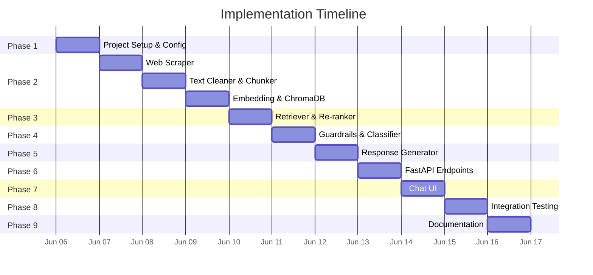

# Implementation Plan — Mutual Fund FAQ Assistant

> **Project:** Facts-Only Mutual Fund FAQ Assistant  
> **AMC:** HDFC Asset Management Company  
> **Estimated Duration:** 5–7 Days  
> **Last Updated:** June 2026

---

## Table of Contents

1. [Overview](#1-overview)
2. [Prerequisites](#2-prerequisites)
3. [Phase 1 — Project Setup & Configuration](#phase-1--project-setup--configuration)
4. [Phase 2 — Data Ingestion Pipeline](#phase-2--data-ingestion-pipeline)
5. [Phase 3 — RAG Pipeline](#phase-3--rag-pipeline)
6. [Phase 4 — Guardrails & Query Classification](#phase-4--guardrails--query-classification)
7. [Phase 5 — Response Generation](#phase-5--response-generation)
8. [Phase 6 — API Layer (FastAPI)](#phase-6--api-layer-fastapi)
9. [Phase 7 — User Interface](#phase-7--user-interface)
10. [Phase 8 — Integration & End-to-End Testing](#phase-8--integration--end-to-end-testing)
11. [Phase 9 — Documentation & Deliverables](#phase-9--documentation--deliverables)
12. [Milestone Summary](#milestone-summary)
13. [Risk Register](#risk-register)

---

## 1. Overview

This implementation plan translates the [architecture](file:///Users/harpreetkaur/Desktop/Milestone-MF/docs/architecture.md) and [problem statement](file:///Users/harpreetkaur/Desktop/Milestone-MF/docs/problemStatement.md) into a phased, actionable development roadmap. Each phase produces independently testable deliverables, ensuring incremental progress toward the final FAQ assistant.

### Goals

- Build a RAG-based assistant that answers **facts-only** queries about 19 HDFC mutual fund schemes
- Retrieve information exclusively from **official public sources** (Groww scheme pages)
- Enforce strict **guardrails** against investment advice, PII, and speculative content
- Deliver a **minimal chat UI** with a disclaimer, welcome message, and example questions

---

## 2. Prerequisites

### 2.1 Environment Requirements

| Requirement | Details |
|---|---|
| **Python** | 3.11 or higher |
| **Node.js** | 18 or higher (for Next.js frontend) |
| **OS** | macOS / Linux / Windows |
| **Disk Space** | ~500 MB (for ChromaDB + scraped data + BGE-small model weights) |
| **RAM** | Minimum 4 GB |

### 2.2 API Keys Required

| Service | Key | Purpose |
|---|---|---|
| **Groq API** | `GROQ_API_KEY` | LLM response generation (LLaMA 3 8B via Groq) |

> BGE-small embeddings run **locally** via `sentence-transformers` — no additional API key required.

### 2.3 Data Sources

- **19 HDFC scheme pages** from Groww (listed in [schemes.md](file:///Users/harpreetkaur/Desktop/Milestone-MF/docs/schemes.md))
- No external databases or paid APIs beyond Groq

---

## Phase 1 — Project Setup & Configuration

**Duration:** Day 1 (0.5 day)

### Tasks

| # | Task | Output |
|---|---|---|
| 1.1 | Create project directory structure as defined in architecture | Folder skeleton |
| 1.2 | Initialize Python virtual environment | `venv/` directory |
| 1.3 | Create `requirements.txt` with all backend dependencies | Dependency manifest |
| 1.4 | Install all Python dependencies | Working Python environment |
| 1.5 | Initialize Next.js frontend app | `frontend/` directory with Next.js scaffold |
| 1.6 | Create `.env` files with API key placeholders | Backend + frontend config files |
| 1.7 | Create `config.py` to load environment variables | Centralized config module |
| 1.8 | Create `.gitignore` for `venv/`, `.env`, `__pycache__/`, `data/chroma_db/`, `node_modules/`, `.next/` | Git ignore rules |

### Directory Structure to Create

```
Milestone-MF/
├── backend/
│   ├── src/
│   │   ├── __init__.py
│   │   ├── app.py
│   │   ├── config.py
│   │   ├── scraper/
│   │   │   ├── __init__.py
│   │   │   ├── scraper.py
│   │   │   └── cleaner.py
│   │   ├── ingestion/
│   │   │   ├── __init__.py
│   │   │   ├── chunker.py
│   │   │   ├── embedder.py
│   │   │   └── ingest.py
│   │   ├── rag/
│   │   │   ├── __init__.py
│   │   │   ├── retriever.py
│   │   │   ├── reranker.py
│   │   │   └── generator.py
│   │   ├── guardrails/
│   │   │   ├── __init__.py
│   │   │   ├── classifier.py
│   │   │   ├── pii_detector.py
│   │   │   └── refusal.py
│   │   └── utils/
│   │       ├── __init__.py
│   │       └── helpers.py
│   ├── data/
│   │   ├── raw/
│   │   ├── processed/
│   │   └── chroma_db/
│   ├── tests/
│   ├── .env
│   └── requirements.txt
├── frontend/
│   ├── app/
│   │   ├── layout.js
│   │   ├── page.js
│   │   └── globals.css
│   ├── components/
│   ├── public/
│   ├── package.json
│   ├── next.config.js
│   └── .env.local
├── docs/
├── .gitignore
└── README.md
```

### `requirements.txt`

```text
fastapi==0.115.*
uvicorn==0.34.*
langchain==0.3.*
langchain-groq==0.3.*
langchain-community==0.3.*
chromadb==0.6.*
beautifulsoup4==4.13.*
requests==2.32.*
python-dotenv==1.1.*
groq==0.18.*
sentence-transformers==3.*
```

### `config.py` — Key Design

```python
import os
from dotenv import load_dotenv

load_dotenv()

GROQ_API_KEY = os.getenv("GROQ_API_KEY")
EMBEDDING_MODEL = "BAAI/bge-small-en-v1.5"
LLM_MODEL = "llama3-8b-8192"
CHROMA_PERSIST_DIR = "data/chroma_db"
COLLECTION_NAME = "hdfc_mutual_funds"
CHUNK_SIZE = 500
CHUNK_OVERLAP = 50
TOP_K = 5
TOP_N_RERANK = 3
SIMILARITY_THRESHOLD = 0.7
```

### Verification

- [ ] All directories exist
- [ ] `pip install -r requirements.txt` completes successfully
- [ ] `npm install` in `frontend/` completes successfully
- [ ] `config.py` loads Groq API key from `.env`
- [ ] BGE-small model downloads on first run of embedder

---

## Phase 2 — Data Ingestion Pipeline

**Duration:** Day 1–2 (1.5 days)

### Overview

Build the offline pipeline that scrapes scheme data from Groww, cleans it, chunks it, generates embeddings, and stores them in ChromaDB.

### Tasks

| # | Task | File | Description |
|---|---|---|---|
| 2.1 | Build web scraper | `src/scraper/scraper.py` | Fetch HTML from 19 Groww URLs |
| 2.2 | Build text cleaner | `src/scraper/cleaner.py` | Extract and clean relevant text from HTML |
| 2.3 | Build chunker | `src/ingestion/chunker.py` | Split cleaned text into 500-token chunks with 50-token overlap |
| 2.4 | Build embedder | `src/ingestion/embedder.py` | **Embedding Model**: `BAAI/bge-small-en-v1.5` (running locally via HuggingFaceEmbeddings, configurable via `EMBEDDING_MODEL_NAME` in `.env`) |
| 2.5 | Build ingestion orchestrator | `src/ingestion/ingest.py` | End-to-end pipeline: scrape → clean → chunk → embed → store |
| 2.6 | Create metadata registry | `data/metadata.json` | Store scheme metadata (name, category, URL, scrape date) |

### 2.1 Web Scraper (`scraper.py`)

**Input:** List of 19 URLs from `schemes.md`  
**Output:** Raw HTML saved to `data/raw/`

```python
# Key functionality:
# - Iterate over scheme URLs
# - Send HTTP GET with appropriate headers (User-Agent)
# - Handle HTTP errors (retry once on failure)
# - Save raw HTML to data/raw/<scheme-slug>.html
# - Return list of successfully scraped URLs
```

**Important considerations:**
- Add a 1–2 second delay between requests to avoid rate-limiting
- Use a browser-like `User-Agent` header
- Log failures without stopping the pipeline

### 2.2 Text Cleaner (`cleaner.py`)

**Input:** Raw HTML files  
**Output:** Clean text saved to `data/processed/`

**Sections to extract from each Groww scheme page:**

| Section | Data Points |
|---|---|
| **Fund Overview** | Fund name, AMC, category, plan type |
| **Returns** | _Redirect to factsheet only_ |
| **Fund Details** | Expense ratio, exit load, minimum investment, SIP minimum |
| **Risk & Rating** | Riskometer category |
| **Benchmark** | Benchmark index name |
| **Fund Manager** | Fund manager name(s) |
| **Scheme Information** | Launch date, AUM, NAV |

**Cleaning rules:**
- Remove all script/style tags, navigation, ads, and footer elements
- Strip HTML tags, normalize whitespace
- Preserve section headers for context
- Prefix each section with scheme name for disambiguation

### 2.3 Chunker (`chunker.py`)

**Chunking strategy:**

Because the extracted data is heavily structured, we use a hybrid semantic chunking approach rather than a flat Recursive Character Splitter over the whole file:

1. **Fast Facts Chunk (`section: fund_details`)**: Combine all key/value pairs (NAV, AUM, Min SIP, Manager, etc.) into a single, cohesive text block that easily fits within context limits.
2. **About Chunk (`section: about_fund`)**: Use `RecursiveCharacterTextSplitter` (size=500, overlap=50) to split the longer descriptive text. Each generated chunk is automatically prefixed with `About {scheme_name}` to guarantee context is never lost.

**Metadata attached to each chunk:**

```json
{
  "chunk_id": "<scheme-slug>-<index>",
  "scheme_name": "HDFC Mid-Cap Fund – Direct Growth",
  "category": "Equity / Mid Cap",
  "source_url": "https://groww.in/mutual-funds/hdfc-mid-cap-fund-direct-growth",
  "section": "fund_details",
  "scrape_date": "2026-06-05"
}
```

### 2.4 Embedder (`embedder.py`)

```python
from langchain_community.embeddings import HuggingFaceBgeEmbeddings

embeddings = HuggingFaceBgeEmbeddings(
    model_name="BAAI/bge-small-en-v1.5",
    model_kwargs={"device": "cpu"},
    encode_kwargs={"normalize_embeddings": True}
)
```

> **Note:** BGE-small runs **locally** — no API calls needed for embeddings. The model (~130 MB) is downloaded once on first use.

### 2.5 Ingestion Orchestrator (`ingest.py`)

**Run as a standalone script:**

```bash
python -m src.ingestion.ingest
```

**Pipeline flow:**
1. Load URL list
2. Scrape all 19 pages → `data/raw/`
3. Clean each page → `data/processed/`
4. Chunk all cleaned text → list of `Document` objects with metadata
5. Embed chunks and store in ChromaDB → `data/chroma_db/`
6. Save metadata registry → `data/metadata.json`
7. Print summary: total chunks, total schemes, any failures

### Verification

- [ ] All 19 URLs are scraped successfully
- [ ] Cleaned text contains expected data points (expense ratio, exit load, etc.)
- [ ] ChromaDB collection has the expected number of chunks
- [ ] `data/metadata.json` contains 19 scheme entries
- [ ] Test query against ChromaDB returns relevant chunks

---

## Phase 3 — RAG Pipeline

**Duration:** Day 2–3 (1 day)

### Tasks

| # | Task | File | Description |
|---|---|---|---|
| 3.1 | Build retriever | `src/rag/retriever.py` | Query ChromaDB with embedded user query |
| 3.2 | Build re-ranker | `src/rag/reranker.py` | Re-rank retrieved chunks by relevance |
| 3.3 | Write unit tests | `tests/test_retriever.py` | Test retrieval accuracy with sample queries |

### 3.1 Retriever (`retriever.py`)

```python
# Key functionality:
# - Load ChromaDB collection
# - Embed user query using BGE-small (local)
# - Perform similarity search with top_k=5
# - Filter results below similarity_threshold (0.7)
# - Return ranked list of (chunk_text, metadata, score)
```

### 3.2 Re-Ranker (`reranker.py`)

**Re-ranking approach (heuristic-based):**

| Factor | Weight | Description |
|---|---|---|
| **Cosine similarity score** | 0.5 | Base relevance from embedding search |
| **Scheme name match** | 0.3 | Boost if the query mentions the retrieved scheme name |
| **Section relevance** | 0.2 | Boost if chunk section matches the query intent (e.g., "expense ratio" → `fund_details` section) |

**Output:** Top-3 chunks after re-ranking

### 3.3 Test Queries

| Test Query | Expected Top Chunk Scheme | Expected Section |
|---|---|---|
| "What is the expense ratio of HDFC Mid-Cap Fund?" | HDFC Mid-Cap Fund | fund_details |
| "Exit load for HDFC Small Cap Fund" | HDFC Small Cap Fund | fund_details |
| "Minimum SIP amount for HDFC Nifty 50" | HDFC Nifty 50 Index Fund | fund_details |
| "What is the risk level of HDFC Balanced Advantage?" | HDFC Balanced Advantage Fund | risk_rating |

### Verification

- [ ] Retriever returns relevant chunks for known queries
- [ ] Re-ranker correctly boosts scheme-name matches
- [ ] Results are within the 0.7 similarity threshold
- [ ] All unit tests pass

---

## Phase 4 — Guardrails & Query Classification

**Duration:** Day 3 (0.5 day)

### Tasks

| # | Task | File | Description |
|---|---|---|---|
| 4.1 | Build PII detector | `src/guardrails/pii_detector.py` | Regex-based detection for PAN, Aadhaar, phone, email |
| 4.2 | Build query classifier | `src/guardrails/classifier.py` | Classify queries as FACTUAL, ADVISORY, or PII_DETECTED |
| 4.3 | Build refusal handler | `src/guardrails/refusal.py` | Generate polite refusal responses |
| 4.4 | Write unit tests | `tests/test_guardrails.py` | Test all guardrail scenarios |

### 4.1 PII Detection Patterns

```python
PII_PATTERNS = {
    "pan": r"[A-Z]{5}[0-9]{4}[A-Z]{1}",
    "aadhaar": r"[0-9]{4}\s?[0-9]{4}\s?[0-9]{4}",
    "phone": r"(\+91)?[6-9][0-9]{9}",
    "email": r"[a-zA-Z0-9._%+-]+@[a-zA-Z0-9.-]+\.[a-zA-Z]{2,}",
}
```

### 4.2 Advisory Keyword List

```python
ADVISORY_KEYWORDS = [
    "should i invest", "recommend", "suggest", "which is better",
    "compare", "vs", "better than", "best fund", "worth investing",
    "will it go up", "future returns", "expected growth",
    "what do you think", "is it good", "is it safe",
    "guaranteed returns", "how much return", "profit",
]
```

### 4.3 Classifier Logic

```python
def classify_query(query: str) -> str:
    # Step 1: Check for PII
    if detect_pii(query):
        return "PII_DETECTED"
    
    # Step 2: Check for advisory intent
    query_lower = query.lower()
    for keyword in ADVISORY_KEYWORDS:
        if keyword in query_lower:
            return "ADVISORY"
    
    # Step 3: Default to factual
    return "FACTUAL"
```

### 4.4 Test Cases

| Query | Expected Classification |
|---|---|
| "What is the expense ratio of HDFC Mid-Cap Fund?" | FACTUAL |
| "Should I invest in HDFC Small Cap Fund?" | ADVISORY |
| "Which fund is better, HDFC Mid-Cap or Small Cap?" | ADVISORY |
| "My PAN is ABCDE1234F, check my fund" | PII_DETECTED |
| "Call me at 9876543210" | PII_DETECTED |
| "What is the exit load?" | FACTUAL |
| "Will HDFC Equity Fund give good returns?" | ADVISORY |

### Verification

- [ ] PII detector catches all 5 PII types (PAN, Aadhaar, phone, email, account)
- [ ] Classifier correctly identifies advisory queries
- [ ] Refusal responses include SEBI/AMFI educational link
- [ ] All unit tests pass

---

## Phase 5 — Response Generation

**Duration:** Day 3–4 (1 day)

### Tasks

| # | Task | File | Description |
|---|---|---|---|
| 5.1 | Build response generator | `src/rag/generator.py` | LLM-based answer generation with prompt template |
| 5.2 | Implement response validation | `src/rag/generator.py` | Validate ≤3 sentences, 1 citation, footer |
| 5.3 | Build prompt template | `src/rag/generator.py` | System prompt with facts-only constraints |
| 5.4 | Write integration tests | `tests/test_retriever.py` | Test full RAG: query → retrieval → generation |

### 5.1 Generator Design

```python
from langchain_groq import ChatGroq

llm = ChatGroq(
    model="llama-3.1-8b-instant",
    api_key=GROQ_API_KEY,
    temperature=0.0,
    max_tokens=256,
)
```

### 5.2 Prompt Template

```text
You are a facts-only mutual fund FAQ assistant for HDFC mutual fund schemes.
Your role is to answer factual questions using ONLY the provided context.

RULES:
1. Answer in a maximum of 3 sentences.
2. Use ONLY the information from the context below.
3. Include exactly ONE source citation link from the provided SOURCE URL.
4. Do NOT provide investment advice, opinions, or recommendations.
5. Do NOT compare fund performance or calculate returns.
6. If the context does not contain the answer, say:
   "I don't have this information in my sources."
7. End every response with: "Last updated from sources: {scrape_date}"

CONTEXT:
{retrieved_chunks}

SOURCE URL: {source_url}

USER QUESTION: {user_query}
```

### 5.3 Response Validation

```python
def validate_response(answer: str) -> dict:
    issues = []
    
    # Check sentence count
    sentences = answer.split(". ")
    if len(sentences) > 3:
        issues.append("Exceeds 3-sentence limit")
    
    # Check for advisory language
    for keyword in ADVISORY_KEYWORDS:
        if keyword in answer.lower():
            issues.append(f"Contains advisory language: '{keyword}'")
    
    # Check for last-updated footer
    if "Last updated from sources:" not in answer:
        issues.append("Missing 'Last updated' footer")
    
    return {"valid": len(issues) == 0, "issues": issues}
```

### Verification

- [ ] Generator produces answers within 3 sentences
- [ ] Answers include exactly one source citation
- [ ] Footer `Last updated from sources: <date>` is present
- [ ] Advisory queries are not answered (even if they bypass the classifier)
- [ ] "I don't have this information" is returned for out-of-scope queries

---

## Phase 6 — API Layer (FastAPI)

**Duration:** Day 4 (0.5 day)

### Tasks

| # | Task | File | Description |
|---|---|---|---|
| 6.1 | Create FastAPI app | `backend/src/app.py` | Main application with CORS, routes |
| 6.2 | Implement `POST /ask` | `backend/src/app.py` | Query endpoint: classify → retrieve → generate |
| 6.3 | Implement `GET /health` | `backend/src/app.py` | Health check endpoint |
| 6.4 | Implement `GET /schemes` | `backend/src/app.py` | List available schemes |
| 6.5 | Configure CORS for Next.js frontend | `backend/src/app.py` | Allow requests from `localhost:3000` |
| 6.6 | Write API tests | `backend/tests/test_api.py` | Test all endpoints |

### 6.1 FastAPI App Structure

```python
from fastapi import FastAPI
from fastapi.staticfiles import StaticFiles
from fastapi.responses import FileResponse
from pydantic import BaseModel

app = FastAPI(title="HDFC Mutual Fund FAQ Assistant")

class QueryRequest(BaseModel):
    query: str

class QueryResponse(BaseModel):
    status: str           # "success" | "refused" | "error"
    query: str
    answer: str
    citation: dict | None = None
    last_updated: str | None = None
    educational_link: str | None = None
    disclaimer: str = "Facts-only. No investment advice."
```

### 6.2 POST `/ask` — Flow

```python
@app.post("/ask", response_model=QueryResponse)
async def ask(request: QueryRequest):
    query = request.query.strip()
    
    # Step 1: Validate input
    if not query:
        return QueryResponse(status="error", query=query, answer="Please enter a valid question.")
    
    # Step 2: PII check
    if detect_pii(query):
        return QueryResponse(status="refused", query=query, answer="...", educational_link="...")
    
    # Step 3: Classify intent
    intent = classify_query(query)
    if intent == "ADVISORY":
        return QueryResponse(status="refused", query=query, answer="...", educational_link="...")
    
    # Step 4: Retrieve relevant chunks
    chunks = retriever.search(query, top_k=5)
    if not chunks:
        return QueryResponse(status="success", query=query, answer="I don't have this information...")
    
    # Step 5: Re-rank
    ranked_chunks = reranker.rerank(query, chunks, top_n=3)
    
    # Step 6: Generate response
    answer, citation = generator.generate(query, ranked_chunks)
    
    # Step 7: Validate and return
    return QueryResponse(status="success", query=query, answer=answer, citation=citation, ...)
```

### 6.3 API Test Scenarios

| # | Test | Method | Endpoint | Expected Status |
|---|---|---|---|---|
| 1 | Health check | GET | `/health` | 200, `{"status": "ok"}` |
| 2 | Factual query | POST | `/ask` | 200, `status: "success"` |
| 3 | Advisory query | POST | `/ask` | 200, `status: "refused"` |
| 4 | PII in query | POST | `/ask` | 200, `status: "refused"` |
| 5 | Empty query | POST | `/ask` | 200, `status: "error"` |
| 6 | List schemes | GET | `/schemes` | 200, array of names |

### Verification

- [ ] `uvicorn backend.src.app:app --reload` starts without errors
- [ ] All API endpoints respond correctly
- [ ] CORS headers allow Next.js frontend requests (`localhost:3000`)
- [ ] All API tests pass

---

## Phase 7 — User Interface

**Duration:** Day 4–5 (1 day)

### Tasks

| # | Task | File | Description |
|---|---|---|---|
| 7.1 | Initialize Next.js app | `frontend/` | Scaffold with `npx create-next-app` (App Router) with Tailwind CSS |
| 7.2 | Build Sidebar component | `frontend/components/Sidebar.jsx` | Left sidebar with 19 interactive fund schemes |
| 7.3 | Build chat page | `frontend/app/page.js` | Main page composing all chat components |
| 7.4 | Build ChatWindow component | `frontend/components/ChatWindow.jsx` | Scrollable message history |
| 7.5 | Build ChatInput component | `frontend/components/ChatInput.jsx` | Input box + send button |
| 7.6 | Build MessageBubble component | `frontend/components/MessageBubble.jsx` | Floating glassmorphism user/bot messages |
| 7.7 | Build WelcomeCard component | `frontend/components/WelcomeCard.jsx` | Welcome message |
| 7.8 | Build DisclaimerBanner component | `frontend/components/DisclaimerBanner.jsx` | Persistent "Facts-only" banner |
| 7.9 | Style the interface | `frontend/app/globals.css`, `tailwind.config.js` | Dark mode, glassmorphism, responsive, floating shadows |
| 7.10 | Configure API proxy | `frontend/next.config.js` | Proxy `/api/*` requests to FastAPI backend |

### 7.1 UI Layout

```
┌──────────────────────────────────────────────┐
│  🏦  HDFC Mutual Fund FAQ Assistant          │
│  ──────────────────────────────────────────  │
│  ⚠️  Facts-only. No investment advice.       │
├──────────────────────────────────────────────┤
│                                              │
│  👋 Welcome! I can answer factual questions  │
│     about HDFC mutual fund schemes.          │
│                                              │
│  Try asking:                                 │
│  ┌──────────────────────────────────────┐    │
│  │ What is the expense ratio of HDFC    │    │
│  │ Mid-Cap Fund?                        │    │
│  ├──────────────────────────────────────┤    │
│  │ What is the exit load for HDFC       │    │
│  │ Small Cap Fund?                      │    │
│  ├──────────────────────────────────────┤    │
│  │ What is the minimum SIP amount for   │    │
│  │ HDFC Nifty 50 Index Fund?            │    │
│  └──────────────────────────────────────┘    │
│                                              │
│  ┌─ Chat Messages ──────────────────────┐    │
│  │                                      │    │
│  │  User: What is the expense ratio...  │    │
│  │  Bot:  The expense ratio of HDFC...  │    │
│  │        📎 Source: [groww.in/...]      │    │
│  │        📅 Last updated: 2026-06-05   │    │
│  │                                      │    │
│  └──────────────────────────────────────┘    │
│                                              │
│  ┌──────────────────────────────┐ [Send]     │
│  │ Ask a question...            │            │
│  └──────────────────────────────┘            │
└──────────────────────────────────────────────┘
```

### 7.2 Design Specifications

| Element | Style |
|---|---|
| **Color scheme** | Dark mode — deep `#0a0e1a` background, soft white text, teal `#00b4a3` accent |
| **Framework** | Tailwind CSS v3 |
| **Font** | `Outfit` from Google Fonts |
| **Layout** | Fixed left sidebar (funds list), flex main chat canvas |
| **Message bubbles** | Smooth `rounded-3xl` chat bubbles with `glass-panel` backdrop-blur and deep 3D `shadow-2xl` floating effects |
| **Interactive Pills** | Selecting a fund in the sidebar prompts quick-action pill buttons (NAV, Expense Ratio, etc.) directly in the chat window |
| **Citations** | Rendered as clickable links below the answer |
| **Animations** | Fade-in for messages, micro-interactions on hover/active states |

### 7.3 Frontend Logic (Next.js)

```javascript
// Key functionality (page.js + components):
// 1. Send user query via POST to FastAPI /ask endpoint
// 2. Display user message immediately (right-aligned)
// 3. Show loading skeleton/spinner
// 4. Parse JSON response
// 5. Display bot message with answer, citation, and footer
// 6. Handle refusal responses (different styling)
// 7. Handle error responses
// 8. Auto-scroll to latest message
// 9. Example questions are clickable → auto-fill and submit
// 10. State management via React useState/useRef hooks
```

### Verification

- [ ] Next.js dev server runs at `http://localhost:3000`
- [ ] FastAPI backend runs at `http://localhost:8000`
- [ ] Frontend successfully proxies API requests to backend
- [ ] Disclaimer banner is visible
- [ ] Welcome message with 3 example questions is displayed
- [ ] Clicking an example question sends the query
- [ ] Bot responses show answer + citation + last-updated date
- [ ] Refusal responses display with distinct styling
- [ ] Loading spinner/skeleton appears while waiting
- [ ] UI is responsive on mobile viewports

---

## Phase 8 — Integration & End-to-End Testing

**Duration:** Day 5–6 (1 day)

### Tasks

| # | Task | Description |
|---|---|---|
| 8.1 | End-to-end factual query test | Test from UI → API → RAG → LLM → response |
| 8.2 | End-to-end advisory refusal test | Verify advisory queries are refused at every level |
| 8.3 | PII rejection test | Verify PII is detected and rejected |
| 8.4 | Edge case testing | Empty queries, very long queries, gibberish input |
| 8.5 | Response format validation | Verify ≤3 sentences, 1 citation, footer on all responses |
| 8.6 | Cross-scheme accuracy test | Test queries for multiple schemes to ensure correct retrieval |
| 8.7 | Performance testing | Measure response latency (target: <5 seconds) |

### 8.1 E2E Test Matrix

| # | Query | Type | Expected Behavior |
|---|---|---|---|
| 1 | "What is the expense ratio of HDFC Mid-Cap Fund?" | Factual | ✅ Answer with expense ratio + citation |
| 2 | "What is the exit load for HDFC Small Cap Fund?" | Factual | ✅ Answer with exit load details + citation |
| 3 | "What is the minimum SIP amount for HDFC Nifty 50?" | Factual | ✅ Answer with SIP minimum + citation |
| 4 | "What benchmark does HDFC Balanced Advantage track?" | Factual | ✅ Answer with benchmark name + citation |
| 5 | "What is the risk level of HDFC Liquid Fund?" | Factual | ✅ Answer with riskometer category + citation |
| 6 | "Should I invest in HDFC Defence Fund?" | Advisory | 🚫 Polite refusal + SEBI link |
| 7 | "Which is better, HDFC Mid-Cap or Small Cap?" | Advisory | 🚫 Polite refusal + SEBI link |
| 8 | "My PAN is ABCDE1234F" | PII | 🔒 PII warning + refuse |
| 9 | "" (empty) | Invalid | ⚠️ "Please enter a valid question" |
| 10 | "What is the expense ratio of SBI Blue Chip?" | Out-of-scope | ℹ️ "I don't have this information" |
| 11 | "How do I download my capital gains report?" | Factual | ✅ Answer with process + citation |
| 12 | "What will be the NAV tomorrow?" | Advisory | 🚫 Polite refusal |

### Verification

- [x] All 12 test scenarios pass
- [x] Response latency < 5 seconds for factual queries
- [x] No advisory language in any factual response
- [x] Citations are valid Groww URLs
- [x] Footer date matches the scrape date

---

## Phase 9 — Documentation & Deliverables

**Duration:** Day 6–7 (1 day)

### Tasks

| # | Task | Output |
|---|---|---|
| 9.1 | Write `README.md` | Setup instructions, AMC selection, architecture overview, known limitations |
| 9.2 | Finalize disclaimer | Ensure _"Facts-only. No investment advice."_ is in UI, README, and all refusal responses |
| 9.3 | Code cleanup | Remove debug logs, add docstrings, format with `black` |
| 9.4 | Final review | Walk through all success criteria from the problem statement |

### 9.1 README Structure

```markdown
# HDFC Mutual Fund FAQ Assistant

## Overview
## Selected AMC & Schemes
## Architecture (RAG Approach)
## Setup Instructions
### Prerequisites
### Installation
### Running the Ingestion Pipeline
### Starting the Server
## Usage
## API Endpoints
## Known Limitations
## Disclaimer
```

### 9.4 Success Criteria Checklist

| # | Criterion | Verification Method |
|---|---|---|
| 1 | Accurate retrieval of factual mutual fund information | E2E test matrix (Phase 8) |
| 2 | Strict adherence to facts-only responses | Advisory query tests + prompt guardrails |
| 3 | Consistent inclusion of valid source citations | Response format validation |
| 4 | Proper refusal of advisory queries | Refusal test cases |
| 5 | Clean, minimal, and user-friendly interface | Visual review of UI |

---

## Milestone Summary



### Phase Summary Table

| Phase | Name | Duration | Key Output |
|---|---|---|---|
| **1** | Project Setup | 0.5 day | Directory structure, dependencies, config |
| **2** | Data Ingestion | 1.5 days | Scraper, cleaner, chunker, ChromaDB populated |
| **3** | RAG Pipeline | 1 day | Retriever, re-ranker, tested with sample queries |
| **4** | Guardrails | 0.5 day | PII detector, query classifier, refusal handler |
| **5** | Response Generation | 1 day | LLM generator with prompt template, validation |
| **6** | API Layer | 0.5 day | FastAPI with 4 endpoints |
| **7** | User Interface | 1 day | Next.js chat UI with components, disclaimer, responsive design |
| **8** | Testing | 1 day | 12 E2E test scenarios passed |
| **9** | Documentation | 1 day | README, code cleanup, final review |
| **10** | Deployment & Docker | 0.5 day | Dockerfiles, docker-compose, Deployment strategies |
| | **Total** | **~7.5 days** | |

---

## Phase 10 — Deployment & Dockerization

**Status:** Completed

### Tasks

| # | Task | Description |
|---|---|---|
| 10.1 | Dockerize Backend | Create `Dockerfile` and `.dockerignore` for FastAPI + ChromaDB |
| 10.2 | Dockerize Frontend | Create `Dockerfile` and `.dockerignore` for Next.js |
| 10.3 | Docker Compose | Create `docker-compose.yml` to orchestrate full stack locally |
| 10.4 | Deployment Strategy | Create `deployment_strategy.md` for Railway (Backend) and Vercel (Frontend) |

---

## Risk Register

| # | Risk | Likelihood | Impact | Mitigation |
|---|---|---|---|---|
| 1 | Groww page structure changes | Medium | High | Build resilient scraper with fallback selectors; re-run ingestion |
| 2 | Groq API rate limits | Low | Medium | Add retry logic with exponential backoff; Groq free tier has generous limits |
| 3 | BGE-small embedding quality for financial terms | Low | Medium | Test with domain-specific queries; consider upgrading to `bge-base` if needed |
| 4 | LLM hallucination despite grounding | Medium | High | Low temperature (0.1), strict prompt constraints, post-validation |
| 5 | ChromaDB storage corruption | Low | High | Keep raw + processed data as backup; re-ingest if needed |
| 6 | Advisory queries bypassing classifier | Medium | Medium | Expand keyword list iteratively; add LLM-based classification as fallback |
| 7 | Incomplete scraping (missing data points) | Medium | Medium | Manual verification of scraped data for each scheme |
| 8 | Next.js ↔ FastAPI CORS issues | Medium | Medium | Configure CORS middleware properly; use proxy in `next.config.js` |

---

> **Document Version:** 1.1  
> **Status:** Final — Completed  
> **References:**  
> - [Problem Statement](file:///Users/harpreetkaur/Desktop/Milestone-MF/docs/problemStatement.md)  
> - [Architecture](file:///Users/harpreetkaur/Desktop/Milestone-MF/docs/architecture.md)  
> - [Scheme List](file:///Users/harpreetkaur/Desktop/Milestone-MF/docs/schemes.md)
